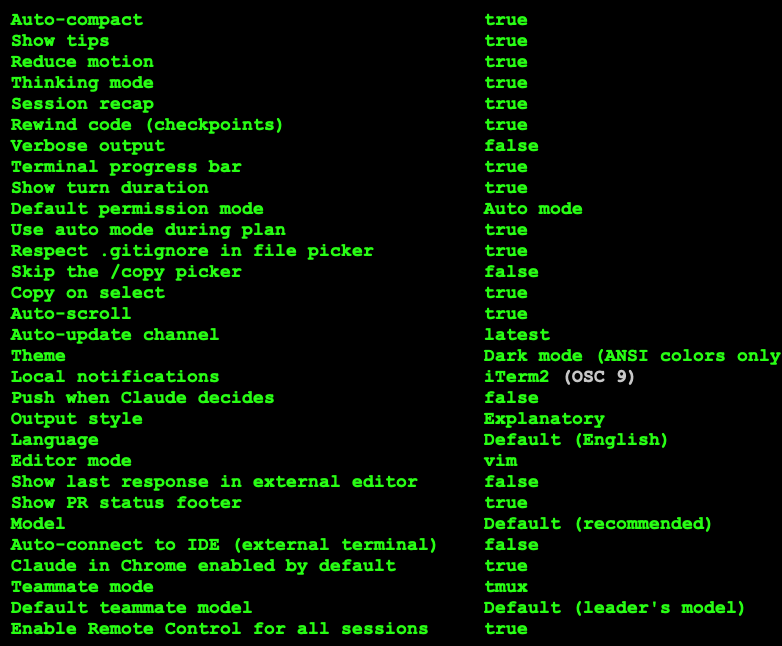

# .claude.example

A working starter bundle for `~/.claude/` — the user-level config directory Claude Code reads on every session. This is the configuration I recommend for everyone new to the tool. Copy it, start using it, customize as you learn.

> This folder is a prototype of a standalone `claudefiles` repo that will get split out later. For now it lives inside the course repo so you can copy it during the workshop.

## What's inside

```
.claude.example/
├── settings.json      # auto permission mode + day-zero plugin auto-install
└── config.png         # snapshot of my /config settings (not in settings.json)
```

Just one config file and one reference screenshot — drop `settings.json` into `~/.claude/`, use `config.png` as a guide for the interactive settings, and you're done.

## `settings.json`

- `permissions.defaultMode: "auto"` — a classifier auto-approves safe actions and prompts for risky ones. **Requires a Max, Team, or Enterprise plan.** Drop to `"acceptEdits"` if you're on Pro.
- `permissions.allow` — common safe commands pre-allowlisted (git, gh, npm/pnpm/yarn, tests, reads, the usual file-inspection Bash commands).
- `permissions.deny` — `sudo`, `rm -rf`, outbound `curl`/`wget`/`ssh`, `.env` reads, private keys.
- `autoInstallEnabledPlugins: true` plus `enabledPlugins` listing all eight day-zero plugins — first time Claude Code sees this file, it installs them all.

## The day-zero plugins

The bundle auto-installs these on first launch. Each one is a small opinionated piece that covers something you'd otherwise have to build yourself:

| Plugin | What it does |
|--------|--------------|
| `claude-code-setup` | Scans your repo and recommends Claude Code automations (hooks, agents, skills) worth adding. Good first-run companion on any new codebase. |
| `claude-md-management` | Audits, improves, and keeps your `CLAUDE.md` files tidy. Ships `/revise-claude-md` to turn session learnings into clean diffs. |
| `commit-commands` | AI-generated commit messages plus a commit → push → PR workflow. Requires the `gh` CLI. |
| `code-review` | Dispatches five parallel review agents (bugs, tests, docs, style, security) against a PR diff and aggregates the findings. |
| `code-simplifier` | Autonomous refactor pass over recent changes — removes dead branches, collapses redundant abstractions, tightens naming. |
| `security-guidance` | `PreToolUse` hook that flags dangerous patterns (leaky logs, unsanitized input, risky shell constructs) before the edit runs. |
| `explanatory-output-style` | Adds short educational "Insight" callouts during code generation so you learn *why*, not just *what*. |
| `learning-output-style` | Interactive mode — Claude sets up scaffolding and asks you to write the meaningful 5–10 lines yourself. Great for workshops and onboarding. |

If autoinstall misbehaves on your setup, fall back to manual install inside a Claude session:

```
/plugin install claude-code-setup@claude-plugins-official
/plugin install claude-md-management@claude-plugins-official
/plugin install commit-commands@claude-plugins-official
/plugin install code-review@claude-plugins-official
/plugin install code-simplifier@claude-plugins-official
/plugin install security-guidance@claude-plugins-official
/plugin install explanatory-output-style@claude-plugins-official
/plugin install learning-output-style@claude-plugins-official
```

## The rest of the config lives in `/config`

`settings.json` only covers a slice of what Claude Code can be configured with. Things like theme, default model, output style, statusline, notification preferences, verbose mode, and a handful of others are managed through the interactive `/config` TUI and written to a separate config file that isn't meant to be hand-edited.

Since I can't ship those as a copy-pasteable file, here's a snapshot of my own `/config` so you can mirror the settings that matter:



Run `/config` inside a Claude Code session to open the same view on your machine and match whichever rows you want.

## Install

### Fresh install — no existing `~/.claude/`

```bash
mkdir -p ~/.claude
cp .claude.example/settings.json ~/.claude/settings.json
```

Start a Claude Code session. On first launch the eight plugins install automatically. Then run `/config` and mirror the screenshot above for anything you care about.

### Existing install — you already have a `~/.claude/`

Merge the keys from `settings.json` into your existing `~/.claude/settings.json`. The ones that matter: `permissions.defaultMode`, `permissions.allow`, `permissions.deny`, `autoInstallEnabledPlugins`, `enabledPlugins`. Restart `claude` — plugins auto-install on the next session.

## Customizing

After a few sessions you'll want to adjust things. The usual edits:

- **Permissions** — add tool patterns you find yourself approving constantly to `allow`; tighten `deny` around any paths or commands that scare you.
- **Plugins** — browse the marketplace with `/plugin` once you're comfortable. Remove any day-zero defaults you don't use.
- **`/config`** — revisit it every few weeks. Model defaults and output styles are the two rows most worth tuning as your taste develops.

## References

- [Claude Code Settings](https://code.claude.com/docs/en/settings)
- [Plugins](https://code.claude.com/docs/en/plugins)
- [Permission Modes](https://code.claude.com/docs/en/permission-modes)
